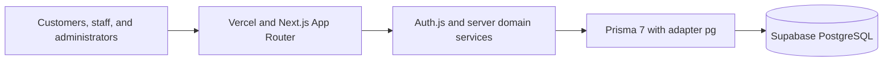
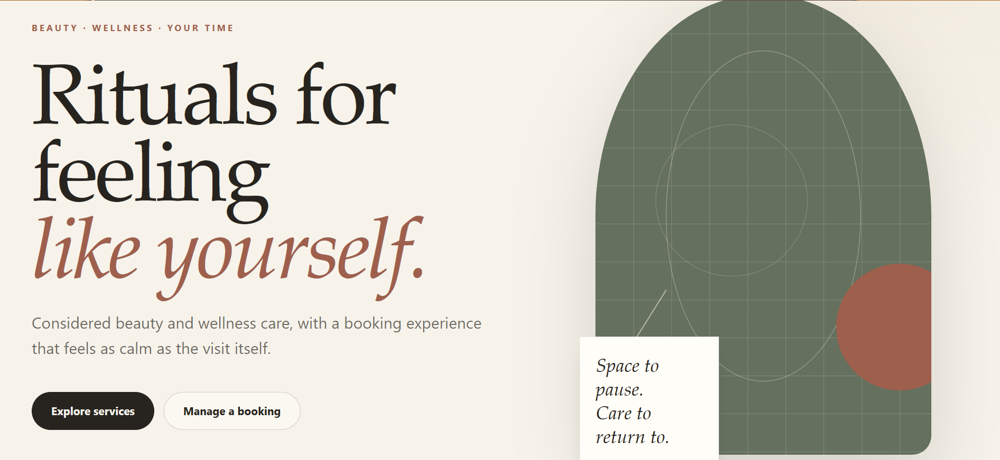
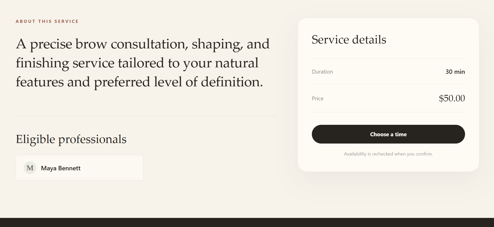
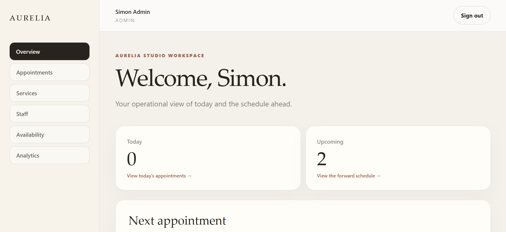

# Aurelia Studio

Aurelia Studio is a production-style, full-stack appointment booking and operations platform for a fictional premium service business. It combines a polished customer journey with real availability computation, secure customer self-service, staff operations, administrator controls, and privacy-conscious analytics.

**Live application:** [aurelia-studio-orcin.vercel.app](https://aurelia-studio-orcin.vercel.app)

**Case study:** [docs/CASE_STUDY.md](docs/CASE_STUDY.md)

## The problem

Appointment scheduling is more than a calendar interface. Customers need a clear path from service discovery to a confirmed appointment. Staff need reliable daily operations. Administrators need control over services, assignments, schedules, blocked time, and reporting. Every path must remain correct through time zones, concurrent requests, cancellations, and reschedules.

Aurelia Studio demonstrates that complete workflow without inventing business metrics or presenting the fictional studio as a real operating company.

## Key capabilities

1. Public service catalogue, professional selection, availability, booking, and confirmation
2. Secure booking lookup using an opaque reference plus the booking email
3. Customer cancellation and rescheduling with policy cutoffs and stale-state protection
4. Staff appointment views, details, status workflows, and scoped schedule management
5. Administrator management for services, staff, assignments, recurring availability, and blocked time
6. Administrator analytics with bounded date ranges, status summaries, trends, popular services, and staff workload
7. Responsive public and internal interfaces with keyboard focus, reduced-motion support, and accessible text equivalents

## Architecture and stack



The application uses TypeScript, Next.js, React, Tailwind CSS, Auth.js, Prisma 7 with `@prisma/adapter-pg`, PostgreSQL, Zod, bcrypt, Vitest, Docker Compose, GitHub Actions, Vercel, and Supabase.

## Engineering highlights

Booking intervals use half-open `[start, end)` semantics. Candidate availability is computed from service duration, staff assignments, recurring windows, blocked time, existing bookings, lead time, booking horizon, and the studio time zone.

Every booking write rechecks authoritative state inside a transaction. A PostgreSQL GiST exclusion constraint remains the final defense against overlapping active bookings, including concurrent creation and rescheduling. Historical service details are stored as booking snapshots, while status and reschedule events provide an audit trail.

Auth.js credentials authentication uses bcrypt hashes and server-enforced ADMIN and STAFF boundaries. Public booking management requires the exact case-sensitive reference and normalized email. Generic failures, action-specific rate limits, bounded validation, explicit public DTOs, private response controls, CSP, and browser security headers reduce exposure.

Studio rules use `America/New_York`, while instants are stored and compared in UTC. Analytics use studio-local date boundaries and expose operational aggregates rather than customer PII or fabricated revenue.

## Testing and production quality

The final suite contains **151 passing tests across 32 files** with PostgreSQL configured. It includes unit coverage and real database integration coverage for migrations, constraints, availability, booking creation, public verification, cancellation, rescheduling, authorization, analytics, DST behavior, and concurrency.

The mixed case booking reference regression is covered through public lookup, rescheduling, and cancellation. Hosted QA also verified the main public and authenticated workflows, responsive layouts, keyboard focus, protected routes, and safe public verification behavior.

```bash
npm test
npm run lint
npm run typecheck
npm run build
git diff --check
```

See [docs/TESTING.md](docs/TESTING.md) for the complete test and QA record.

## Production deployment

The application is deployed on Vercel with Supabase PostgreSQL. Runtime traffic uses a pooled TLS connection, while controlled Prisma migrations use a direct session connection. Secrets remain in provider environment storage and are not committed to the repository.

Deployment, migration, rollback, and hosted verification details are recorded in [docs/DEPLOYMENT.md](docs/DEPLOYMENT.md).

## Selected screenshots

### Public home



### Service details


### Administrator overview


### Mobile service catalogue


The complete curated set is documented in [docs/SCREENSHOTS.md](docs/SCREENSHOTS.md).

## Local development

Node.js 20.9 or newer and Docker Compose are required. Local PostgreSQL uses host port `5434`.

```bash
npm install
Copy-Item .env.example .env
docker compose up -d db
npm run db:migrate
npm run db:smoke
npm run db:bootstrap:services
npm run db:bootstrap:booking-demo
npm run dev
```

Add development values for `AUTH_SECRET` and `RATE_LIMIT_SECRET` to the uncommitted `.env` file. Administrator provisioning reads credentials from the shell and never prints the supplied password.

Open [http://localhost:3000](http://localhost:3000).

## Documentation

1. [Case study](docs/CASE_STUDY.md)
2. [Architecture](docs/ARCHITECTURE.md)
3. [Database design](docs/DATABASE.md)
4. [API conventions](docs/API.md)
5. [Testing strategy and evidence](docs/TESTING.md)
6. [Security baseline](docs/SECURITY.md)
7. [Deployment record](docs/DEPLOYMENT.md)
8. [Screenshot evidence](docs/SCREENSHOTS.md)
9. [Task roadmap](docs/TASKS.md)

## Status

Database design, public booking, verified customer changes, staff appointment operations, administrator management, schedule management, analytics, responsive front-end polish, security hardening, production deployment, hosted QA, screenshots, and portfolio documentation are complete.
