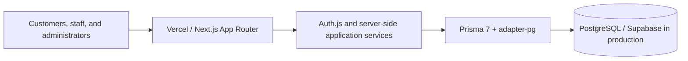

# Aurelia Studio

Aurelia Studio is a fictional premium beauty and wellness studio, built as a production-style appointment platform for public booking and role-aware staff operations.

The completed product includes the Task 011.5 public experience refresh, Task 012 dashboard analytics, Task 013 frontend polish, and Task 014 security hardening; Task 015 deployment evidence remains deliberately pending real Vercel and Supabase work.

## The problem

Appointment scheduling is deceptively complex: customers need a clear booking journey, staff need reliable daily operations, and availability must remain correct through time zones, concurrent requests, cancellations, and reschedules. Aurelia Studio demonstrates a focused solution without inventing revenue or customer-impact claims for a fictional business.

## Key capabilities

- Public service discovery, availability, guided booking, and confirmation
- Verified reference-plus-email booking lookup, cancellation, and rescheduling
- Staff appointment workflows and own-schedule controls
- ADMIN controls for services, staff, availability, blocked time, and analytics
- Timezone-aware scheduling with transactional checks and PostgreSQL conflict authority
- Responsive, accessible public and internal interfaces

The project currently includes the **Task 011.5 public experience refresh**, **Task 012 dashboard analytics workflow**, and **Task 013 frontend polish**: a cohesive responsive studio identity across discovery, booking, confirmation, and verified booking management, backed by the complete Task 011 transactional workflow, plus privacy-conscious operational analytics and a refined accessible internal workspace.

The public interface uses a restrained ivory, charcoal, sage, and clay palette; an editorial display face paired with a readable interface sans; shared controls and surface styles; responsive navigation; explicit selected/loading/empty/error states; and reduced-motion-aware transitions. This presentation layer does not alter booking policies, API contracts, authentication, or persistence behavior.

## Architecture and stack



The stack is TypeScript, Next.js, React, Tailwind CSS, Auth.js, Prisma 7 with `@prisma/adapter-pg`, PostgreSQL, Zod, bcrypt, Vitest, Docker Compose, and GitHub Actions.

## Engineering highlights

- Booking intervals use `[start, end)` semantics. Application transactions re-check current availability and PostgreSQL GiST exclusion constraints remain the final concurrent-write defense.
- Booking snapshots preserve historical service details while staff/services evolve. Status and reschedule events provide an audit trail.
- Auth.js credentials authentication uses bcrypt, role-aware server authorization, and current-user database rechecks for disablement/deletion.
- Public booking management requires an opaque high-entropy reference plus normalized email. Sensitive responses are no-store and action-specific rate limits persist only HMAC identities.
- Studio-local business rules use `America/New_York`; instants are stored and compared in UTC. Analytics intentionally expose operational aggregates rather than invented revenue.
- Production hardening includes CSP and browser security headers, explicit DTOs, bounded inputs, and no raw database failures in public responses.

## Testing

`npm test` currently runs **148 tests across 31 files** when PostgreSQL is configured. The suite includes real PostgreSQL integration coverage for migrations, exclusion constraints, public booking flows, authorization scope, analytics boundaries, DST behavior, and concurrent booking/change races.

```bash
npm test
npm run lint
npm run typecheck
npm run build
```

See [the testing strategy](docs/TESTING.md) for coverage and hosted-QA status.

## Production deployment

The intended production architecture is Vercel plus an isolated Aurelia Supabase PostgreSQL project. `DATABASE_URL` is a pooled TLS runtime connection; `DIRECT_URL` is a direct TLS connection reserved for controlled Prisma migrations. Migrations run once with `npm run db:deploy`, never via `db push` or application startup.

No hosted environment, production URL, or screenshots are claimed in this repository yet. The exact deployment, production-bootstrap, rollback, and verification runbook is in [Deployment](docs/DEPLOYMENT.md).

## Case study and screenshots

The [case study](docs/CASE_STUDY.md) explains the product and engineering decisions without representing Aurelia as a real client. [Screenshot evidence](docs/SCREENSHOTS.md) is deliberately marked pending until captured from a verified hosted build with fictional data.

## Local development

Requires Node.js 20.9 or newer and Docker Compose. Local PostgreSQL uses host port `5434`.

```bash
npm install
Copy-Item .env.example .env # PowerShell; keep .env uncommitted
docker compose up -d db
npm run db:migrate
npm run db:smoke
npm run db:bootstrap:services # create missing development catalogue entries
npm run db:bootstrap:booking-demo # optional create-only staff/schedule demo data
# Optionally set WORKFLOW_ADMIN_PASSWORD, WORKFLOW_STAFF_A_PASSWORD, and
# WORKFLOW_STAFF_B_PASSWORD, then create appointment workflow QA fixtures:
npm run db:bootstrap:appointment-workflow
# Add development AUTH_SECRET and RATE_LIMIT_SECRET values to .env.
# Then provide ADMIN_NAME, ADMIN_EMAIL, and ADMIN_PASSWORD in your shell:
npm run admin:provision
npm run dev
```

Open [http://localhost:3000](http://localhost:3000).

## Quality commands

```bash
npm run lint
npm run typecheck
npm test
npm run build
```

Database commands are available as `db:generate`, `db:migrate`, `db:deploy`, `db:status`, `db:bootstrap`, `db:bootstrap:services`, `db:bootstrap:booking-demo`, `db:smoke`, and `db:studio`. Both catalogue/demo bootstraps are development-only and create missing data without overwriting existing records. Demo staff receive random, undisclosed credential material and are for scheduling QA, not sign-in. `admin:provision` creates the first active administrator without printing the supplied password.

## Documentation

- [Product requirements](docs/PRODUCT_REQUIREMENTS.md)
- [Architecture](docs/ARCHITECTURE.md)
- [Database design](docs/DATABASE.md)
- [API conventions](docs/API.md)
- [Task roadmap](docs/TASKS.md)
- [Architecture decisions](docs/DECISIONS.md)
- [Testing strategy](docs/TESTING.md)
- [Security](docs/SECURITY.md)
- [Deployment](docs/DEPLOYMENT.md)
- [Definition of done](docs/DEFINITION_OF_DONE.md)
- [Case study plan](docs/CASE_STUDY.md)
- [Screenshot plan](docs/SCREENSHOTS.md)

## Status

Database, public booking, verified customer changes, scoped appointment operations, admin management, schedule management, analytics, frontend polish, and security hardening are implemented. Production deployment, hosted QA, screenshots, and final deployment evidence are pending real Vercel/Supabase account access and must not be inferred from local validation.
