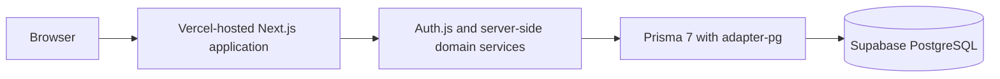

# Aurelia Studio — Appointment Booking & Operations Platform

## Overview

Aurelia Studio is a fictional portfolio application for a premium beauty and wellness business. It demonstrates a polished self-service booking journey alongside role-aware staff and administrator operations.

## Problem and solution

Scheduling is more than a calendar UI: customers need dependable discovery and booking, while the business needs accurate availability, protected customer information, and auditable changes that remain correct under concurrency. Aurelia Studio combines public service discovery, guided booking, verified booking management, staff appointment workflows, administrator controls, availability management, and privacy-conscious operational analytics.

## Users and key workflows

- **Customers:** discover services, choose a professional or any available professional, select availability, book, and manage a booking with its reference plus email.
- **Staff:** view and operate on their own appointments and maintain only their own availability.
- **Administrators:** manage the catalogue, staff, schedules, blocked time, appointments, and aggregate analytics.

## Technical architecture

The stack is TypeScript, Next.js App Router, React, Tailwind CSS, Auth.js, Prisma 7, PostgreSQL, Zod, bcrypt, Vitest, Docker Compose, and GitHub Actions. The intended hosted configuration uses a pooled TLS runtime connection and a separate direct TLS migration connection.

## Booking integrity

Bookings use half-open intervals, `[startAt, endAt)`. The application rechecks availability in a transaction, validates selected staff and service state, and records immutable service snapshots. PostgreSQL’s GiST exclusion constraint is the final authority for active booking overlaps, so concurrent create/reschedule races cannot silently double-book a professional. Expected state and start time prevent stale changes, while audit events retain lifecycle history.

## Security and privacy

Staff authentication uses Auth.js credentials authentication with bcrypt hashes. Authorization is enforced at server boundaries: ADMIN controls management and analytics, while STAFF scope is tied to the assigned resource. Current-user database rechecks promptly remove access for disabled or deleted accounts.

Public booking management requires a high-entropy opaque reference plus normalized email. Generic failures limit enumeration, HMAC-backed action-specific rate limits avoid raw-identity persistence, and public DTOs exclude contact details, notes, staff emails, audit data, and authentication data. CSP, framing protection, MIME sniff prevention, referrer controls, and a restrictive permissions policy protect the browser surface.

## Timezone handling and analytics

Business rules are evaluated in `America/New_York`; timestamps are stored and compared as UTC instants. Availability and analytics cover local-day boundaries and DST changes. The dashboard reports bounded operational aggregates—status totals, trends, service ranking, and workload—without customer PII, booking references, rate-limit data, or fabricated revenue.

## QA and deployment

The verified local suite contains 148 tests across 31 files when PostgreSQL is configured, including database integration coverage for constraints, transactions, role scope, public verification, rate limits, DST, analytics privacy, and concurrent booking/change behavior.

The deployment design is ready for an isolated Aurelia Supabase project and Vercel production deployment from `main`. No production project, URL, database, credentials, migration result, screenshot, or hosted QA result is claimed yet. Hosted smoke testing, responsive/keyboard checks, browser-console inspection, and server-log review must be recorded from a real environment. See [Deployment](DEPLOYMENT.md).

## Challenges and outcome

The key decisions were keeping availability advisory in the UI while PostgreSQL remains authoritative, handling DST safely, enabling public changes without customer accounts, and separating serverless runtime pooling from migration ownership. The finished codebase demonstrates full-stack engineering across relational design, scheduling correctness, RBAC, secure public mutations, responsive UI, testing, and deployment readiness—without presenting fictional business metrics as real outcomes.

## Limitations and future work

V1 has no payments, customer accounts, SMS/email notifications, MFA, password reset, CAPTCHA, multi-location support, edge/WAF abuse controls, or formal accessibility certification. A real deployment should also add operational monitoring, backup-restoration drills, and professional security/accessibility assessment appropriate to its audience.
