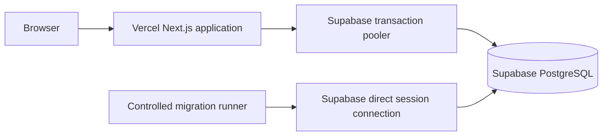

# Production Deployment

## Current production state

Aurelia Studio is deployed at [https://aurelia-studio-orcin.vercel.app](https://aurelia-studio-orcin.vercel.app).

Vercel hosts the Next.js application. Supabase provides PostgreSQL. The deployed repository baseline is the merged `origin/main` commit `d552f2e13575f6ab5f27d755f886a0f7a74bf2f9`, which includes the mixed-case booking reference fix. This SHA is recorded from Git history. Provider secrets and deployment identifiers are intentionally not stored here.

## Production architecture



Runtime application traffic uses the pooled TLS `DATABASE_URL`, configured for the Supabase transaction pooler on port `6543`. Controlled Prisma migration commands use the direct or session TLS `DIRECT_URL` on port `5432`. Application instances do not run migrations during startup.

## Environment configuration

Production configuration includes the following server-only values. Their contents are never committed, printed, or copied into documentation.

1. `DATABASE_URL` for pooled runtime traffic
2. `DIRECT_URL` for controlled Prisma migrations
3. `AUTH_SECRET` for authentication-state signing
4. `RATE_LIMIT_SECRET` for HMAC-based limiter identities
5. Short-lived administrator provisioning inputs used only during the controlled provisioning command

Vercel and Supabase store production secrets. Local `.env` files remain ignored. Preview and development environments should use separate credentials and must not silently mutate production data.

## Migration and release workflow

1. Review application, dependency, and migration changes.
2. Confirm the intended `main` commit and production environment configuration.
3. Run `npm run db:deploy` once from a controlled runner using `DIRECT_URL`.
4. Confirm committed migrations, PostgreSQL extensions, and the active booking exclusion constraint.
5. Deploy the immutable Vercel build.
6. Run public and authenticated hosted smoke tests.
7. Inspect security headers, private-response caching, logs, time-zone display, responsive behavior, and database connection health without recording sensitive values.

`prisma db push` is not used for production releases. Schema migration is not performed by every serverless instance.

## Hosted QA record

Hosted QA verified:

1. Public service browsing and service details
2. Availability and professional eligibility
3. Public booking creation and confirmation
4. Booking lookup with the correct reference and email
5. Public rescheduling and cancellation
6. Administrator login and protected route behavior
7. Appointment status progression from `PENDING` to `CONFIRMED` to `COMPLETED`
8. Public changes reflected in the administrator workspace
9. Responsive mobile and desktop spot checks
10. Keyboard navigation and visible focus spot checks
11. Generic public verification failures and absence of obvious secret or private data exposure

The booking-change defect discovered during hosted QA is documented in [CASE_STUDY.md](CASE_STUDY.md). The fix is merged, regression tested, and free of the temporary diagnostics used to isolate it.

## Security release checks

Vercel terminates HTTPS. The application supplies CSP, framing protection, MIME sniff prevention, referrer controls, and a restrictive permissions policy, while disabling `X-Powered-By`. Sensitive booking responses are not stored in shared caches, and verified booking management is not indexed.

Network identity for application rate limiting is accepted only from Vercel's trusted forwarding header. Email and booking-reference HMAC buckets remain the application-level defense. Platform controls, monitoring, backup restoration drills, and incident response remain operational responsibilities beyond this repository.

## Database and connection operations

The Prisma client is reused within a development process and uses bounded pool settings. A stale local development process may retain earlier environment or pool state after connection configuration changes; restarting that process is the correct first operational check. Production pool values should be changed only from measured provider evidence, not in response to an isolated development timeout.

Monitor failed constraints, connection saturation, migration health, and slow scheduling queries without logging customer PII or connection strings. Backups inherit the same sensitivity as the live database.

## Rollback and secret response

For an application-only regression, restore a previously verified immutable Vercel deployment after confirming database compatibility. Do not reverse a database migration by guesswork. Prefer a reviewed forward fix or a tested restore procedure.

If a secret may have been exposed, rotate it in the provider, redeploy, invalidate affected authentication state where appropriate, and review access logs without copying sensitive payloads into the repository.

## Local verification commands

```bash
npm test
npm run lint
npm run typecheck
npm run build
git diff --check
```

The final documented run completed with 151 passing tests across 32 files, active PostgreSQL integration suites, and successful lint, type checking, production build, and diff checks.
